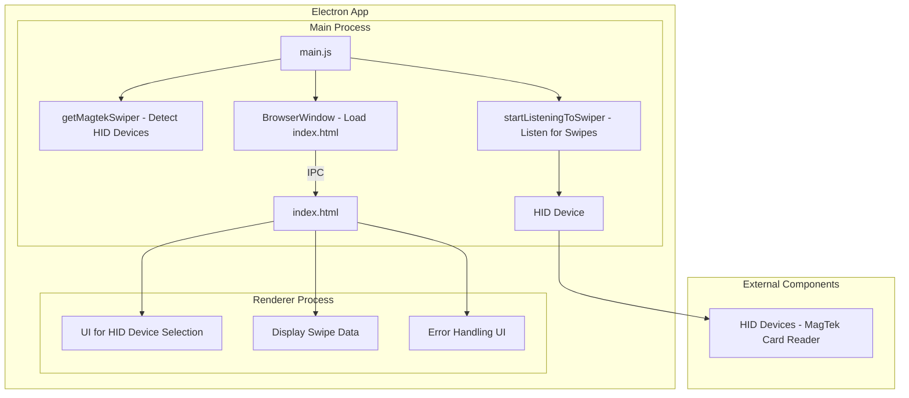

# **Electron HID Device Listener Application Documentation**

## **1. Introduction**

### **Project Name**
**Onecard Swipeout** - Version 1.1.1 Release

### **Purpose**
Onecard Swipeout is an Electron-based desktop application designed to detect and interface with HID (Human Interface Device) readers, particularly MagTek card swipe readers. It processes card swipe data to extract user identification information and displays it to the user, as well as emulating keystrokes of the 7-digit onecard ID# from the swiped card, if available.

### **Target Audience**
This application is intended for internal use by staff managing attendance of events.

### **Overview**
The application automatically detects connected MagTek HID devices, allows the user to select an appropriate device if multiple are available, and listens for card swipe events. The parsed data is displayed in the application interface, and errors are handled gracefully.

---

## **2. Application Architecture**

### **Technology Stack**
- **Electron**: Cross-platform desktop application framework
- **Node.js**: JavaScript runtime environment
- **node-hid**: Node.js package for accessing HID devices
- **libnut.node**: Open-source

### **High-Level Architecture**
#### Architecture Diagram


The application consists of the following main components:
- **Main Process (`main.js`)**: Manages the lifecycle of the application, creates the main window, handles IPC communications, and manages the HID listener.
- **Renderer Process (`index.html`)**: Displays the user interface and handles user interactions, such as selecting a HID device and displaying swipe data.
- **HID Device Module (`magtekSwiper.js`)**: Contains the logic for detecting, connecting to, and listening for data from HID devices.

### **Module Overview**

#### **main.js**
- Manages application lifecycle events (`ready`, `quit`, etc.).
- Creates the main application window and loads the UI from `index.html`.
- Handles IPC communication between the main process and the renderer process.
- Detects HID devices using `magtekSwiper.js` and starts the listener.

#### **magtekSwiper.js**
- Uses the `node-hid` library to detect available HID devices.
- Exposes functions for starting and stopping the listener on a selected HID device.
- Parses swipe data to extract user identification information (name and Onecard ID).

#### **index.html**
- The markup used by the renderer to display the UI, including options for selecting a HID device and displaying swipe data.
- Handles user interactions and communicates with the main process via IPC.

#### **libnut.node**
- The Node Native Module that emulates keystrokes using the Windows native input API.
- Compliled from source by Electron when this application is packaged for release.

---

## **3. Security Considerations**

### **Data Handling**
- The application processes data from HID devices, specifically extracting user identification information such as name and Onecard ID from card swipes.
- No data is stored permanently or transmitted over a network. All data is processed in-memory and displayed in the application interface or passed to the OS using a native API call.

### **IPC Communication**
- IPC (Inter-Process Communication) is used to facilitate communication between the main process and the renderer process.
- To minimize security risks, context isolation is enabled, and node integration is only used where necessary.

### **Device Access**
- The application requires access to HID devices, specifically card swipe readers.
- It uses the `node-hid` library to interact with these devices, which may require elevated permissions on some systems.

### **Error Handling**
- Errors during HID device detection, connection, or data processing are logged to the console and displayed in the UI.
- The application ensures that errors do not crash the process, and users are informed of any issues.

---

## **4. Installation and Setup**

### **System Requirements**
- **Operating System**: Windows 10/11

### **Installation Steps**
1. Run the MSI Installer downloaded from https://Github.com/DaveLuhman/OnecardSwipeout/releases


### **Configuration**
- No additional configuration is required. The application will automatically detect connected HID devices or prompt the user on launch.

---

## **5. Operational Procedures**

### **Starting the Application**
- Run the application using the desktop shortcut placed by the installer on setup.
- The application window will open, and the detection of HID devices will begin automatically.

### **Normal Operation**
- If a MagTek MSR device is detected, the application will start listening for card swipes immediately.
- If no MagTek devices are detected, a dropdown will appear in the UI for the user to select the appropriate device. This is to allow other HID-enabled MSR devices to be used, should users prefer a different manufacturer.
- Swipe data is parsed and displayed in the application interface, and keystrokes are fired emulating the typing of the 7-digit onecard ID#.

### **Shutting Down**
- Close the application window, which will trigger the `before-quit` event to safely close the HID listener.
- The application will ensure all resources are released before quitting. No threads remain open/running after the main thread is terminated.

---

## **6. Maintenance and Support**

### **Updating the Application**
- As of the initial release, no plans for additional functionality have been made and no support or updates are to be provided.

### **Known Issues and Limitations**
- The application does not support all types of HID devices; it is specifically designed for MagTek card readers. Users may attempt other MSR devices but they must be HID-enabled.
- If the HID device is disconnected during operation, the application may need to be restarted.

### **Troubleshooting**
- **No HID devices detected**: Ensure the device is properly connected and recognized by the operating system.
- **Application crashes**: Uninstall the application via the Windows appwiz.cpl control panel menu and reinstall with the provided installer.

---

## **7. Compliance and Legal Considerations**

### **Licensing**
- This application is closed-source, and it's contents (not including dependancies) are to be treated as propriatery.
- This application's license will be transferred to Madison Area Techncial College upon approval.
- Dependencies are licensed for commercial use under open-source licenses (see `package.json` for details).

### **Data Compliance**
- The application does not store or transmit personal data; however, it is designed to process user identification information. Ensure compliance with local data protection regulations if modifications are made that affect data handling.

---

## **8. Conclusion**

### **Final Notes**
- This documentation provides a comprehensive overview of the Onecard Swipeout Application, its architecture, security considerations, and operational procedures.
- Please refer to the appendices for additional technical details and troubleshooting tips.

### **Contact Information**
- **Developer**: DaveLuhman
- **Email**: dave@ado.software
- **GitHub**: https://github.com/DaveLuhman

---

## **9. Appendices (Optional)**

### **Code Samples**
- **Parsing Swiped Card Data**:
   ```javascript
    const parseSwipeData = (data) => {
    try {
        const regex = /(?<=\^)(.*?)(?=\^)/ // Regular Expression to match anything between two carets (^)
        const rawName = regex.exec(data) // executes the above Regex against the swipe data
        const name = rawName[0].trim() // removes any whitespace from before and after the matched name
        const onecardRegex = /(\d{7})\s{3}/ // Regular Expression to match the seven digits preceeding whitespace of 3 or more characters
        const onecard = onecardRegex.exec(data) // executes the above regex against the swipe data
        return { onecard: onecard[0].trim(), name } // returns the whitespace-trimmed onecard and name values as an POJO
    } catch (error) { // error handling
        console.log(error.message) // logs error message to console.
        throw new Error('Unable to determine Onecard/Name from provided input') // hoists error to function caller to handle
    }
    }
   ```

### **Changelog**
- **Version 1.0.0**: Initial release.

### **Dependency List**
- **Electron**: MIT License
- **node-hid**: MIT License
- **NUT.js**: Apache 2.0 License
